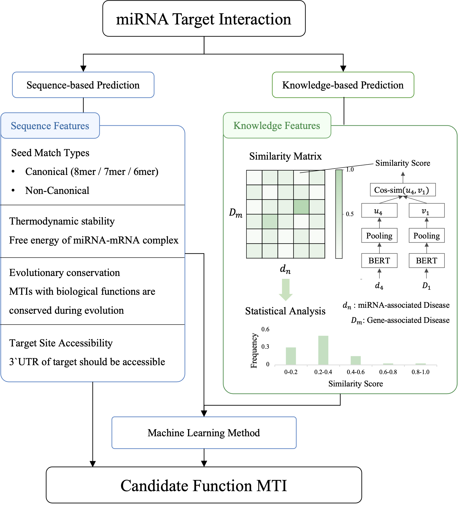

# Leveraging Disease Association Degree for High-Accuracy MicroRNA Target Prediction

[](https://elifesciences.org/articles/109602v1)
[](LICENSE)

This repository contains the official implementation of the paper: **"Leveraging Disease Association Degree for High-Accuracy MicroRNA Target Prediction"**.

---

## 📖 Abstract

Accurate identification of functional microRNA–target interactions (MTIs) is crucial but remains challenging, as experimental validation is limited compared to the large number of sequence-based predictions. This study introduces a novel MTI prediction method that uses disease association degree between microRNA and gene as a key feature.

## 🛠️ Method Overview



*Figure 1: The miRTarDS workflow. Disease descriptions for miRNAs and target genes are encoded using a fine-tuned Sentence-BERT model. The semantic similarity between these embeddings serves as a single discriminative feature for classifying functional vs. predicted MTIs.*

---

## ✨ Features

- **Novel Approach:** Presents a new method for MicroRNA target prediction that investigates the role of miRNA–gene–disease associations, offering a new perspective compared to sequence-based prediction models.
- **Semantic Similarity Quantification:** Implements a fine-tuned Sentence-BERT model to generate disease description embeddings and compute their semantic similarity.
- **Ready-to-Use Pipeline:** Provides complete code for data processing, model training, evaluation.

---

## 📁 Project Structure
```bash
miRTarDS/
├── config/
│   └── [configuration files for running .py programs]
├── disease_embedding/
│   └── [pre-computed disease embeddings generated by src/embedding_diseases.py]
├── output/
│   └── [documentation and result outputs]
├── raw_data/
│   ├── [original datasets]
│   └── data_url.xlsx [data versions and sources reference]
├── SBERT_model/
│   ├── multi-qa-MiniLM-L6-cos-v1/ [base Sentence-BERT model without fine-tuning]
│   └── LR_5e-6-2_3e-6-2/ [fine-tuned Sentence-BERT models]
├── src/
│   ├── data/ [code for generating training-test datasets]
│   ├── MISIM.py [implementation of MISIM method]
│   ├── compute_MISIM_scores.py [computes disease association scores using MISIM]
│   ├── MISIM_PU_Learning.py [PU Learning using MISIM scores as classification features]
│   ├── embedding_diseases.py [embeds disease semantics using SBERT models]
│   └── miRTarDS_PU_Learning.py [PU Learning implementation for miRTarDS evaluation metrics]
├── workflow.png
├── LICENSE
└── README.md
```

---

## 🚀 Quick Start

Follow these steps to quickly set up and run the miRTarDS pipeline.

1. Clone this repository:
```bash
git clone https://github.com/cbaiming/miRTarDS.git
cd miRTarDS
```

2. Unzip the data file & SBERT Model
```bash
unzip MTI/concat_MTIs_with_counts.txt.zip -d MTI/
unzip SBERT_model/LR_5e-6-2_3e-6-2.zip -d SBERT_model/
```

3. Generate Disease Embeddings
```bash
cd src
python embedding_diseases.py
```

4. Run miRTarDS for Benchmarking (The config file can be adjusted to test different models and datasets)
```bash
python miRTarDS_PU_Learning.py
```

5. Run MISIM for Benchmarking
```bash
python compute_MISIM_scores.py
python MISIM_PU_Learning.py
```

---

## 📊 Expected Results

- Direct random sampling of Predicted MTI, then Splits data based on groups (miRNA IDs) to prevent biological leakage.
```bash
========================================
FINAL SUMMARY (External Validation Set - Group Split)
========================================
             Model   Ext_AUC    Ext_F1
2       PU_XGBoost  0.951140  0.899133
1  PU_RandomForest  0.949572  0.896992
0  PU_DecisionTree  0.948543  0.889888
3   PU_LogisticReg  0.946861  0.892532
4    Naive_XGBoost  0.945984  0.885154
```

- Using the KNN method to extract MTI, ensuring that the disease entry distribution of experimentally validated MTI and predicted MTI is consistent.
```bash
========================================
FINAL SUMMARY (External Validation Set - Group Split)
========================================
             Model   Ext_AUC    Ext_F1
0  PU_DecisionTree  0.762841  0.745415
1  PU_RandomForest  0.752716  0.739246
3   PU_LogisticReg  0.726060  0.730193
4    Naive_XGBoost  0.722720  0.657289
2       PU_XGBoost  0.722117  0.672330
```

- Performance of MISIM Method.
```bash
========================================
FINAL SUMMARY (External Validation Set - Single Feature)
========================================
             Model   Ext_AUC    Ext_F1
3   PU_LogisticReg  0.557242  0.582969
1  PU_RandomForest  0.525440  0.541573
0  PU_DecisionTree  0.522939  0.550276
4    Naive_XGBoost  0.520729  0.580645
2       PU_XGBoost  0.517504  0.521940
```

---

## 📄 Acknowledgements
- Reviewer Thanks: We sincerely thank the reviewers for their valuable suggestions, which have improved the methodology described herein. Please note that some methodological refinements were made. **We plan to keep refining miRTarDS in revision.**

- Raw Data Availability: Due to GitHub's file size limit of 100 MB per file, some original datasets cannot be hosted in this repository. For complete data access, please refer to the data_url.xlsx file, which provides detailed version information and download links.

- AI Assistance Statement: In this study, artificial intelligence (AI) tools were utilized to assist with code completion.
---
